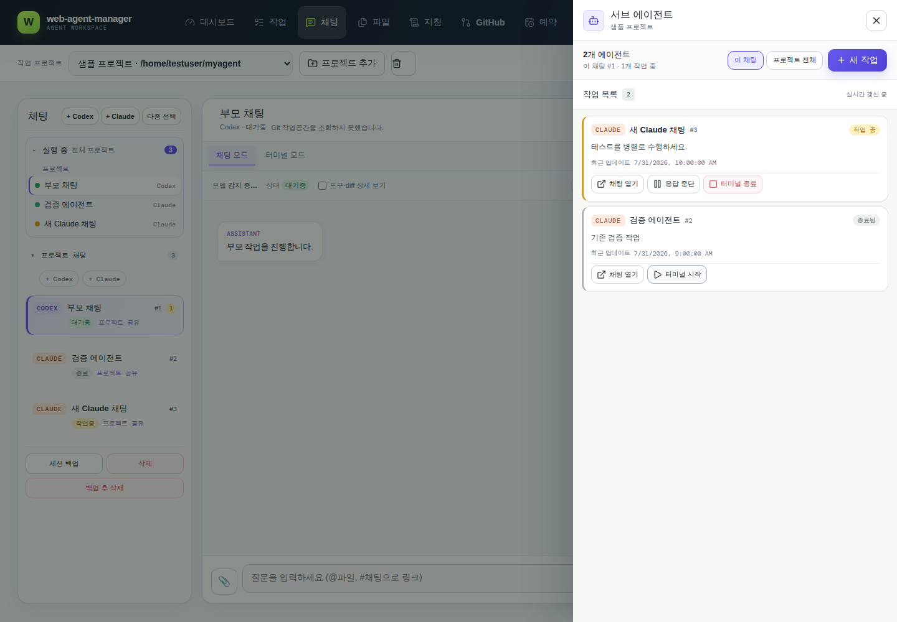
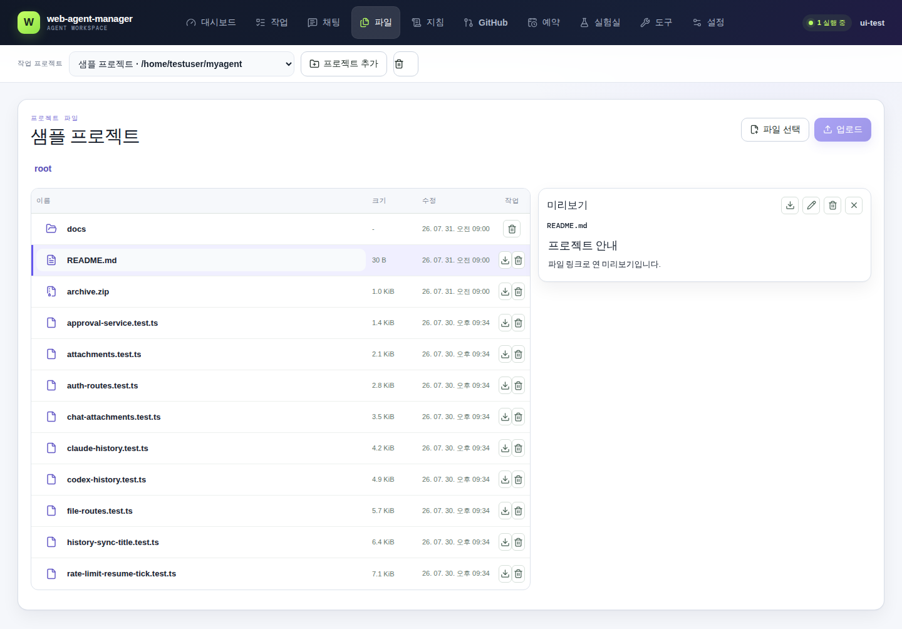
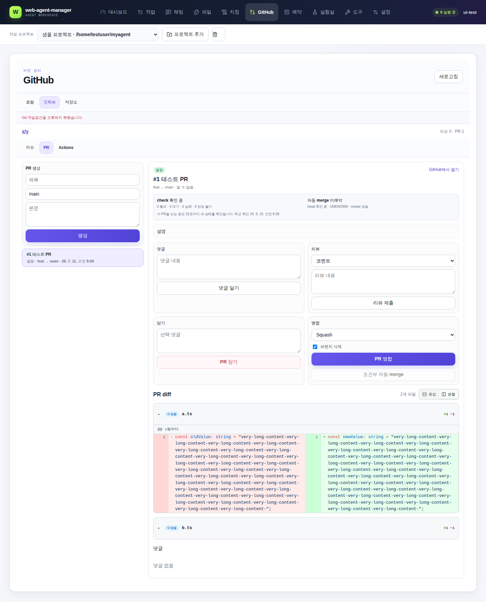
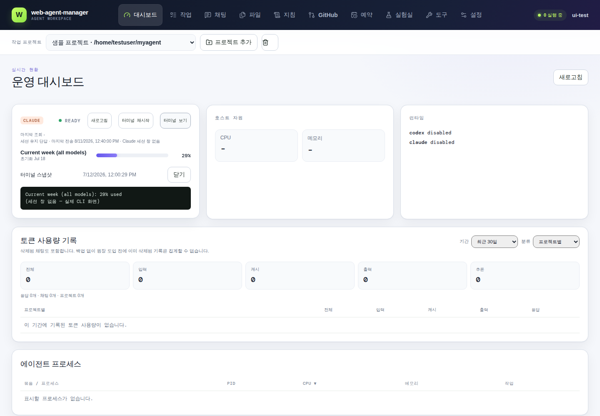
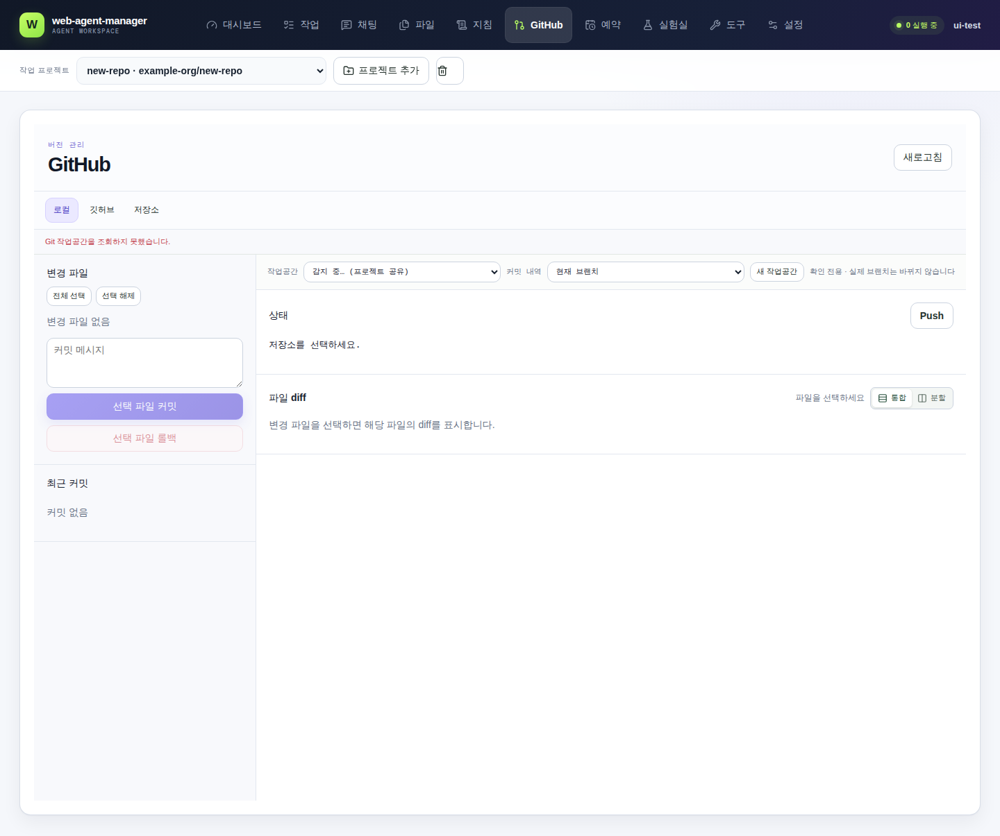
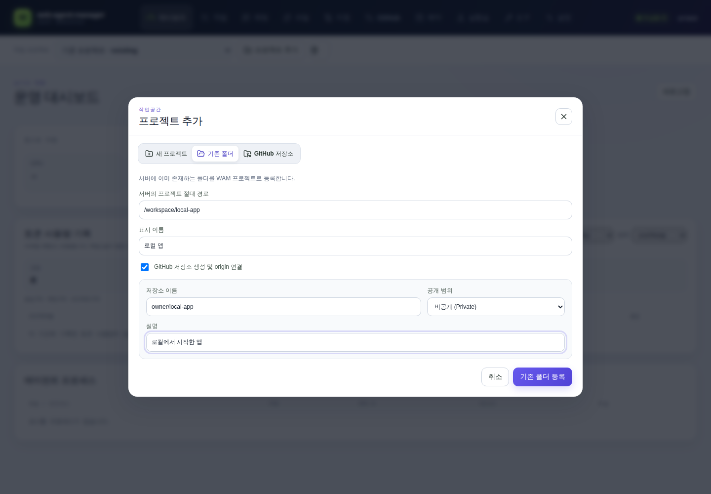
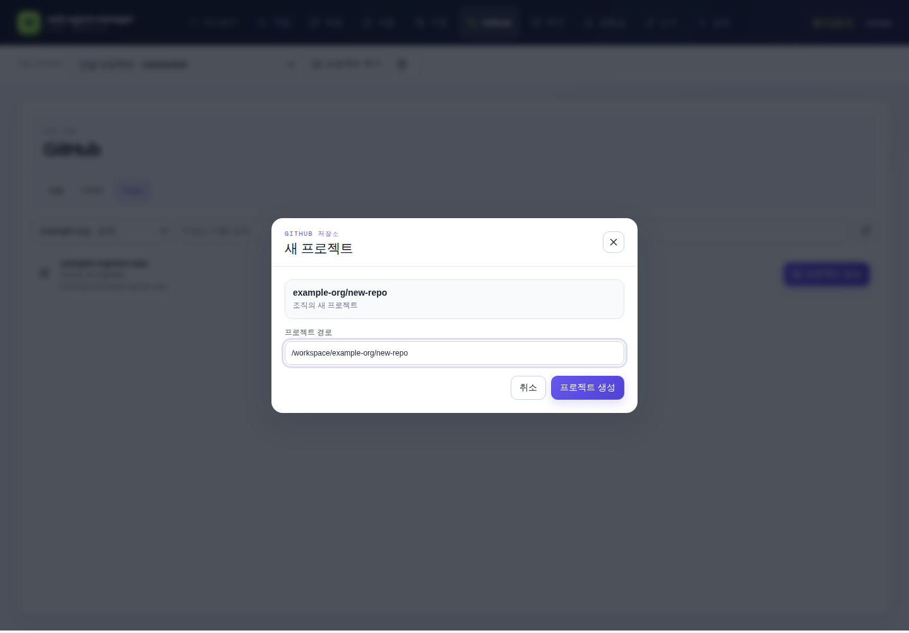
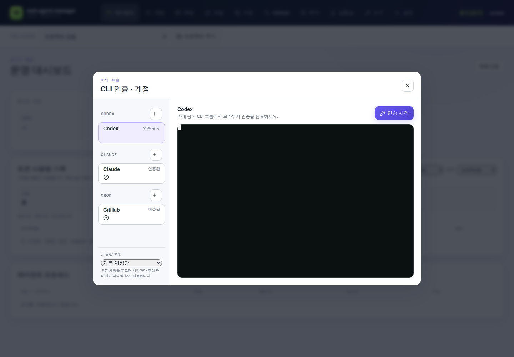

# web-agent-manager

Linux·macOS와 Windows WSL2에서 Codex CLI와 Claude Code의 실제 인터랙티브 TUI를 한 웹 화면으로 관리하는 애플리케이션이다. 각 채팅은 독립 tmux 세션과 PTY를 사용하며, 대화 내용은 터미널 문자열이나 DB 미러링이 아니라 공급자 전역 JSONL 기록을 매 요청 직접 읽어(mtime 캐시 적용) 커서 페이지네이션으로 표시한다. DB에는 앱 자체 메타데이터(상태·프로젝트·tmux·approval)만 저장한다.

보안 문제는 [SECURITY.md](SECURITY.md)의 비공개 절차로 제보한다. 개발 참여 방법은 [CONTRIBUTING.md](CONTRIBUTING.md), 릴리즈별 변경 내용은 [CHANGELOG.md](CHANGELOG.md)에서 확인한다. 이 프로젝트는 [MIT License](LICENSE)로 배포한다.

## 주요 기능

- Codex·Claude 새 채팅, 채팅 ID 주소(`?chat=번호`)로 바로 열기, 계정별 마지막 프로젝트·채팅 복원, 사이드 토글형 상단 원본 터미널, 일반 질문과 슬래시 명령 입력
- 탭·프로젝트·채팅·파일 폴더·미리보기 위치를 URL과 브라우저 history에 기록해 뒤로가기/앞으로가기로 web-agent-manager 내부 탐색 복원
- Codex 내부 권한 상승 검토용 JSONL과 실제 사용자 메시지가 없는 Claude 상태 조회·local-command 전용 JSONL 세션은 일반 채팅 목록에 노출하지 않음
- 응답은 마크다운(GFM: 표·코드블록·목록 등)으로 렌더링, 도구 실행·diff 상세는 체크박스를 켜야만 노출(기본은 완전히 숨김, 켜면 실제로 펼쳐짐)하고 diff는 GitHub·git처럼 줄 색상으로 표시. 대화 가상 스크롤은 하단을 보고 있을 때 새 답변을 계속 따라가되 wheel·touch·pointer 입력이 시작되면 자동 추적을 즉시 멈추고 과거 위치를 보존하며, 실제 사용자 스크롤에서만 이전 메시지를 추가로 불러옴
- 원본 터미널에서 텍스트를 선택한 채 Ctrl+C를 누르면 SIGINT 대신 선택 영역을 클립보드로 복사(선택이 없으면 평소대로 인터럽트)
- Alt+Enter 또는 Ctrl+Enter로 메시지 전송, 전송 즉시 사용자 메시지를 화면에 먼저 표시하고 JSONL 반영이 확인되면 실제 메시지로 교체. Codex·Claude가 작업 중이어도 전송 버튼과 입력창을 유지해 후속 질문·명령을 TUI 큐로 보내며 중지 버튼도 함께 제공
- 채팅창에서 이미지 붙여넣기·파일 드래그앤드롭·첨부 버튼으로 업로드, 프로젝트 폴더 저장 경로를 실제 터미널 입력에 반영, 이미지는 전송 전 입력창 위 썸네일 미리보기와 메시지 목록에서의 인라인 미리보기 모두 지원. AI 응답의 현재 프로젝트 절대·상대 파일 링크는 페이지를 벗어나지 않고 파일 탭의 해당 경로·미리보기로 이동하고, 채팅 첨부는 프로젝트·채팅 소유권을 확인하는 전용 API로 미리보기·다운로드
- 채팅창에 시작 배너·하단 상태줄·JSONL 기록(턴마다 갱신되어 배너 파싱을 놓쳐도 복구됨)으로 감지한 현재 모델과 공급자 대표 사용량(Codex 주간, Claude 현재 세션)·초기화 시각 표시, Codex·Claude `/model` 화면을 파싱한 모델 선택과 추론 강도 적용 지원(Claude 최신 TUI는 `/effort <강도>` 별도 명령으로 적용, 모델 옵션은 채팅별 마지막 성공값을 유지하되 적용할 때는 실제 채팅의 최신 메뉴에서 같은 모델 ID의 현재 번호를 다시 찾아 선택)
- 채팅 제목 옆 편집 버튼으로 이름을 바꾸면 Codex·Claude 공통 `/rename` 명령을 실제 CLI 세션에 그대로 보내고(터미널에서 `codex resume`·`claude --resume`으로 찾을 때도 그 이름이 쓰임) web-agent-manager 쪽 제목도 즉시 갱신, 사람이 직접 바꾸지 않은 채팅은 Claude가 CLI에서 이미 보여주는 표시 이름(자동 생성 기본값 또는 실제 터미널에서 `/rename`으로 바꾼 값)이나 대화 요약 제목(aiTitle)이 있으면 첫 메시지 그대로 대신 그 이름으로 계속 자동 갱신(직접 바꾼 제목은 절대 덮어쓰지 않음)
- 모바일에서는 모델·상태·사용량 컨트롤이 담긴 상태바를 한 줄 요약으로 접어두고, 눌러야 기존 전체 컨트롤(모델·추론 강도 선택, 모드 전환 등)이 펼쳐짐(데스크톱은 항상 펼쳐진 상태 유지)
- Claude 채팅 실행 중에는 "모드 전환" 버튼으로 Shift+Tab을 tmux에 전달해 기본(권한 요청)·auto-accept edits·plan mode를 순환
- 터미널 실행 상태, 전송 중 상태, pending 승인, 리밋 재개 대기를 합쳐 채팅별 `대기중`·`작업중`·`권한 요청`·`리밋 대기` 상태 표시(Codex 작업중 상태줄은 프롬프트 위/아래 위치 모두 감지, Claude는 도구 호출 턴과 순간적인 idle 화면 깜빡임을 완료로 오판하지 않으며, 종료된 채팅은 불완전한 외부 기록에 busy가 남아도 `종료`를 우선 표시), 채팅 목록은 ID를 함께 표시하고 최근 작업순으로 재동기화
- 작업중일 때는 전송 버튼이 중지 버튼으로 바뀌어, 클릭하면 ESC로 진행 중인 응답을 중단하고 잠시 후 터미널이 실제로 입력 가능한 상태인지 다시 확인, 입력창이 비어 있으면 방금 중단시킨 질문을 그대로 복구(이미 입력해둔 내용이 있으면 덮어쓰지 않음)
- 종료된 채팅은 웹에서 "터미널 시작" 버튼으로 다시 시작하거나, 입력 시 저장된 공급자 세션 ID로 자동 resume
- 채팅 세션을 앱 데이터 디렉터리에 백업하고, 공급자 JSONL과 앱 메타데이터를 바로 삭제하거나 백업 후 삭제하며, 백업 JSONL을 원래 공급자 기록 저장소로 복원하거나 필요 없어진 백업 사본만 목록에서 바로 삭제(원본 채팅은 그대로 유지)
- 서버 재시작 후 앱 소유 tmux 재연결 및 기존 전역 세션 자동 등록
- Codex TUI 승인 호환 계층, Claude `PermissionRequest` 훅 기반 웹 승인과 훅 밖 rate-limit 선택·대형 세션 resume 선택·디렉터리 신뢰 확인(y/n)·경량 모델 전환 화면 감지(요청유형에 맞는 버튼 라벨과 알림 요약 표시), 선택 채팅 안에서 인라인 승인 처리. 데스크톱 권한 요청 패널은 현재 프로젝트에 대기 요청이 있을 때만 나타나고 평소에는 채팅 본문이 해당 폭을 사용
- 공급자별 전용 상태 PTY, 60초 주기 사용량 및 reset 시각 조회, 대시보드에 마지막 파싱 시각 표시와 카드별 새로고침 버튼(즉시 재조회 요청), CLI가 옛 스냅샷을 돌려줘 같은 창의 사용량이 뒤로 후퇴하면 마지막 정상값을 유지하고 stale로만 표시
- CPU·메모리·디스크·네트워크·프로세스·채팅 상태 대시보드(각 프로세스가 어느 프로젝트/채팅에 속하는지 표시, 컬럼 클릭으로 정렬, 관리자는 프로세스 종료·강제 종료 가능), 웹소켓 실시간 반영과 1분 주기 안전망 새로고침
- 장기 세션의 수십 MB JSONL은 최초 한 번만 전체 파싱하고 이후 추가된 레코드만 증분 반영하며, 터미널 상태는 headless 화면에서 공유 판정해 반복 `tmux capture-pane` 프로세스와 일시 메모리 사용을 제한
- 관리자만 대시보드에서 Slack bot token·channel id와 ntfy topic·서버 URL을 각각 저장(DB 우선, 없으면 환경변수로 대체)하고 테스트 메시지 전송 가능 — 작업 완료·권한 요청·사용량 한도 도달/초기화·터미널 종료 알림이 등록된 채널 전부(Slack·ntfy 동시)에 전송됨
- 웹소켓 연결이 끊기면 자동 재연결하고 연결이 열릴 때마다 채팅 목록·현재 메시지를 서버 기준으로 재동기화해 끊긴 사이 놓친 작업 상태 이벤트를 복구, 모바일에서 앱이 백그라운드 후 다시 보일 때도 최신 상태를 강제로 재조회(새로고침 없이 복구)
- 채팅 선택은 사용자가 직접 고른 채팅을 단일 기준으로 유지하고, 이전 채팅에서 늦게 끝난 목록·메시지·URL 복원 응답은 선택 버전 검사로 폐기한다. 선택·목록 재조회·전송·실시간 이벤트 흐름은 클라이언트 `[web-agent-manager:chat]`와 서버 `[web-agent-manager:chat:server]` 로그로 추적 가능
- 서버·클라이언트 상세 로그를 데이터 디렉터리 `logs/`에 날짜별 파일(`server-날짜.log`, `client-날짜.log`)로 저장 — 서버는 콘솔 출력 전부와 API 요청(메서드·경로·상태·소요시간·사용자)·프로세스 오류를, 클라이언트는 콘솔 로그와 전역 오류를 로그인 후 배치 전송으로 남기며 14일 지난 파일은 자동 정리(`WEB_AGENT_MANAGER_LOG_LEVEL`로 레벨 조정). 문제 추적용 임시 상세 로그로 상태 판정(작업중·승인·모델·권한 모드·사용량 파싱)의 터미널 스냅샷 원본과 판정 결과, 클라이언트 API 호출·웹소켓 수신 인/아웃 전체도 debug 레벨로 기록(같은 화면·같은 판정 반복은 생략, 비밀 값은 마스킹)
- 프로젝트/전역 `AGENTS.md`, `CLAUDE.md` 전용 편집, `CLAUDE.md`가 `AGENTS.md`를 import하도록 보장하는 공통 지침 옵션
- 총량·파일 수·시간·동시 요청·디스크 여유 한도를 적용한 프로젝트 파일 업로드와 원자적 덮어쓰기 정책, 단일 다운로드, symlink를 제외한 조밀한 리스트형 탐색기. 신뢰 네트워크에서만 일반 점 파일을 표시하며 Markdown(GFM)·sandbox HTML·이미지·영상·오디오·PDF·일반 텍스트 형식별 미리보기와 ZIP·EPUB 압축파일 안내를 제공하고, 모바일 미리보기는 선택 즉시 화면 상단 전용 오버레이로 표시
- 등록 프로젝트에 `web-agent-manager-session-context`와 `web-agent-manager-delegate` 스킬을 Codex·Claude용으로 자동 연결하고, 소유자 전용 Unix 소켓·stdio MCP/CLI로 채팅 번호 또는 프로젝트별 세션 문맥 조회, 7일 스냅샷, 멱등 작업 전달, 새 자식 채팅 생성, 완료 대기·응답 회수를 지원. 명시적 위임과 복잡한 구현·보안 교차검증에 한정해 Claude와 Codex가 서로를 자식 작업자로 호출하고 부모가 결과를 검토해 이어서 작업할 수 있음
- 관리자는 채팅 헤더의 서브 에이전트 패널에서 현재 채팅을 부모로 한 새 Codex·Claude 자식 채팅을 만들고, 위임 작업과 실제 대상 상태를 확인하며 해당 채팅 열기·응답 중단·터미널 종료·재시작을 수행. 생성 폼은 `새 작업`을 눌렀을 때만 펼쳐지고 목록은 상태·최근 갱신·명시적 제어 버튼 중심으로 표시
- 관리자가 설치된 Codex·Claude CLI의 전역 스킬·web-agent-manager MCP 연동 상태를 확인하고 한 번에 연결. 공급자를 나중에 설치해도 화면 복귀 시와 60초마다 다시 감지해 연결 버튼 표시
- 관리자 헤더의 키 버튼에서 Codex device auth, Claude 계정 로그인, GitHub web auth를 공식 CLI PTY로 실행하고 인증 URL을 새 탭으로 열기. 토큰·CLI 설정 내용은 WAM API나 DB로 전달하지 않음
- 도구 탭에서 Claude/Codex별 commands·skills·marketplace·MCP 카탈로그 확인, Claude 프로젝트 `.mcp.json`과 Codex 사용자/프로젝트 `config.toml` 기반 MCP 추가·수정·삭제·Codex 활성화 토글 관리, provider CLI가 보고하는 연결 상태 전용 MCP도 read-only로 표시(기존 env/header 값은 웹에 표시하지 않고 키 이름만 표시). 최초 카탈로그 응답 전에는 로딩 스피너를 표시하고 성공 응답 후에만 항목 없음 안내를 표시
- Diff/GitHub 분리 탭, GitHub식 변경 파일 목록과 파일별 접힘 diff, 이전·이후 줄 번호와 삭제·추가 블록을 좌우 정렬하고 긴 줄은 각 열 안에서 개행하는 분할 보기/기존 통합 보기 선택. 대용량 PR은 파일 목록만 먼저 표시하고 펼친 파일의 줄 DOM만 지연 렌더링. 최근 커밋 클릭 상세 diff, 브랜치·선택 커밋·push, GitHub 이슈·PR 목록/상세/생성/댓글/닫기/다시 열기/리뷰/병합과 Actions 재실행 관리(일부 gh 조회 실패 시 가능한 목록은 유지하고 영역별 오류 표시). GitHub 최초 조회 전에는 로딩 스피너, 응답 후에는 인증 필요 또는 이슈·PR·워크플로별 기록 없음 상태를 구분해 표시
- GitHub 탭에서 인증 계정과 소속 조직별 저장소를 검색하고 확인 팝업에서 clone 경로를 지정해 프로젝트 생성. 같은 origin의 프로젝트가 이미 있으면 중복 clone 없이 기존 프로젝트 채팅으로 이동하며, 로컬 프로젝트 등록 시 새 GitHub 저장소 생성·공개 범위·설명·origin 연결을 함께 선택 가능
- Slack 승인 요청·작업 완료·비정상 종료·사용량 한도 초기화 알림, 작업 완료·한도 초기화 시 브라우저 알림(헤더에서 권한 요청)
- 사용량 한도(rate limit)에 걸리면 "재설정까지 대기"를 사람 개입 없이 자동 선택(Claude의 예전 `Enter selection [1-2]` 형식과 최신 제목·wait/upgrade 선택지·공통 푸터 형식을 모두 감지)하고, Codex의 `try again at` 시각은 절대 재개 시각으로 저장해 실제 초기화 후 실행 중인 터미널에만 "계속"을 보내 하던 작업을 자동으로 이어감. 사용자가 터미널을 종료하면 대기를 취소하며 종료된 세션을 자동으로 다시 시작하지 않음
- 로그인 세션, CSRF, 경로/symlink 검증, 감사 로그

## 화면

| Claude·Codex 서브 에이전트 작업 관리 | Markdown 등 형식별 파일 미리보기 |
| --- | --- |
|  |  |

| GitHub PR 통합·분할 diff | 사용량 원본 화면과 운영 지표 |
| --- | --- |
|  |  |

| GitHub 저장소 프로젝트 목록 | 로컬 프로젝트와 GitHub 저장소 동시 생성 |
| --- | --- |
|  |  |

| GitHub 저장소 프로젝트 생성 팝업 | CLI 인증 팝업 |
| --- | --- |
|  |  |

## 개발 구조

프론트엔드는 `src/client/main.tsx`가 최상위 상태와 실시간 연결을 조정하고, 화면 단위 구현은 `src/client/features/*` 아래에 둔다. 공통 API 호출은 `src/client/api.ts`, 표시·승인·포맷 유틸은 `src/client/lib/*`, 클라이언트 공통 타입은 `src/client/types.ts`를 사용한다. 공급자별 TUI 준비/작업중 판정, 사용량 파싱, 모델 메뉴 조작, slash 명령 특례, 표시 라벨과 대표 사용량 창은 `ProviderAdapter` 구현에 둔다. Claude 파서는 screen-reader 출력과 일반 TUI 출력의 시작 배너, placeholder 프롬프트, 대형 세션 resume 선택 화면, `/model`, `/usage`, `/effort` 확인 형식을 모두 처리한다. 클라이언트의 공급자 버튼·라벨·대표 사용량 구간은 `/api/providers` 응답을 기준으로 렌더링한다. 주요 파일 역할은 `CODETREE.md`를 기준으로 확인한다.

공식 Codex/Claude CLI·데스크톱 앱 대비 남은 구현 후보는 `TODO_LIST.md`에 정리한다.

## 기준 환경

- Linux x86_64 또는 macOS x64/arm64
- Windows는 WSL2 x86_64
- Node.js 22 이상
- Codex CLI 0.146.0
- Claude Code 2.1.220
- tmux 3.4
- Git 및 GitHub CLI

CLI 인증은 앱이 토큰을 받는 방식이 아니다. 관리자가 헤더의 키 버튼을 누르면 서비스 사용자 권한으로 `codex login --device-auth`, `claude auth login --claudeai`, `gh auth login --web` 공식 흐름을 PTY에서 시작한다. 화면에는 CLI 출력과 인증 URL만 중계하고 토큰·CLI 설정 파일 내용은 읽거나 DB에 저장하지 않는다.

## 설치

### Docker

Docker만 설치된 Linux 서버에서는 앱과 Node.js 22, tmux, Git, GitHub CLI, Codex CLI, Claude Code가 함께 들어 있는 이미지를 사용할 수 있다.

```bash
docker compose up -d --build
```

`http://localhost:4317`에 접속해 첫 관리자 계정을 만든다. 로그인하면 인증되지 않은 CLI의 인증 관리 창이 자동으로 열리며, 이후 상단 연동 알림에서 Codex·Claude 전역 스킬과 `web-agent-manager` MCP를 연결할 수 있다. GitHub 인증을 마치면 GitHub 탭의 저장소 목록에서 프로젝트를 바로 만들 수 있다.

Compose는 WAM DB·로그를 `wam-data`, clone 프로젝트를 `wam-projects`, 세 CLI의 사용자 설정을 `wam-home` 볼륨에 보존한다. 호스트 프로젝트를 직접 노출하려면 `wam-projects:/workspace`를 `/호스트/경로:/workspace` bind mount로 바꾸되 컨테이너 서비스 UID `10001`의 읽기·쓰기 권한을 준비해야 한다. Docker socket과 `privileged` 권한은 사용하지 않는다. 외부 주소로 서비스할 때는 `WEB_AGENT_MANAGER_PUBLIC_URL`을 실제 HTTPS origin으로 지정한다.

태그와 `main` push는 `.github/workflows/docker-image.yml`에서 linux/amd64·linux/arm64 이미지를 빌드해 `ghcr.io/<소유자>/web-agent-manager-app`에 게시한다. builder는 런타임 `/app`과 구분되는 전용 경로를 사용해 공개 산출물의 빌드 머신 절대 경로 검사를 유지한다.

### v0.2.0 압축 배포

`npm run release:package`는 production 빌드와 CycloneDX SBOM, SHA-256 체크섬을 포함한 다음 배포 파일을 `release/archives/`에 만든다.

- `web-agent-manager-v0.2.0-linux-x64.zip`
- `web-agent-manager-v0.2.0-macos-x64.zip`
- `web-agent-manager-v0.2.0-macos-arm64.zip`
- `web-agent-manager-v0.2.0-windows-wsl-x64.zip`
- `web-agent-manager-sbom.cdx.json`
- `SHA256SUMS`

압축 해제 후 Linux는 `./setup.sh`, macOS는 `setup.command`, Windows는 `setup-windows.cmd` 하나만 실행하면 production 의존성 설치, 관리자 생성, Codex·Claude 스킬/MCP 연결 확인 후 서버 실행까지 이어진다. 고급 운영에서는 기존 `install`, `create-admin`, `run` 스크립트를 단계별로 사용할 수 있다. Windows는 tmux와 Unix socket 의존성 때문에 WSL2 진입점으로 동작한다. 각 대상 OS에 Node.js 22 이상과 tmux가 먼저 설치돼 있어야 하며, 설치 스크립트가 해당 OS에서 native Node 의존성을 설치한다.

### Electron 데스크톱

Linux·macOS Electron 패키지는 production 서버와 같은 웹 UI를 포함해 기능이 분기되지 않는다. 첫 실행에서 관리자 계정을 만들고, 설치된 Codex·Claude CLI가 있으면 스킬과 `web-agent-manager` MCP 연결도 자동 보정한다. 시스템 Node.js 22 이상과 tmux는 필요하다.

```bash
npm run desktop
npm run desktop:package
```

설치 파일은 `release/desktop/`에 생성된다. `.github/workflows/release-desktop.yml`은 태그 또는 수동 실행 시 Linux x64 AppImage·deb, macOS Intel x64·Apple Silicon arm64 dmg·zip, Windows x64 NSIS·portable을 각 운영체제 runner에서 빌드한다. macOS는 네이티브 모듈 아키텍처를 보장하기 위해 Intel과 Apple Silicon runner를 분리하며, 태그 빌드는 아티팩트 파일명의 중복을 검사한 뒤 해당 GitHub Release에 산출물과 전체 체크섬을 자동 첨부한다. Windows Electron은 네이티브 tmux 백엔드를 포함하지 않으므로 `setup-windows.cmd`로 실행한 WSL2 서버 또는 `WEB_AGENT_MANAGER_SERVER_URL`로 지정한 기존 서버를 여는 데스크톱 셸이다. 현재 데스크톱 산출물에는 플랫폼 코드 서명을 적용하지 않으므로 운영체제의 미확인 게시자 경고가 표시될 수 있다.

### 소스 설치

```bash
npm ci
npm run build
```

`.env.example`을 참고해 systemd의 `EnvironmentFile` 또는 실행 환경에 설정한다. `WEB_AGENT_MANAGER_PROJECTS_DIR`은 GitHub 저장소의 기본 clone 경로이고, 프로젝트 등록은 관리자 전용 기능이라 기본적으로 경로 제한이 없다. 특정 디렉터리로만 제한하고 싶을 때만 `WEB_AGENT_MANAGER_ALLOWED_ROOTS`에 쉼표로 구분해 등록한다. 외부 접속 시에는 HTTPS reverse proxy를 사용하고 `WEB_AGENT_MANAGER_PUBLIC_URL`을 실제 origin과 일치시킨다.

이전 이름으로 설치한 환경은 기존 `MYAGENT_*` 변수를 계속 읽지만 새 `WEB_AGENT_MANAGER_*` 값이 있으면 이를 우선한다. 기존 로그인 쿠키와 `.myagent-uploads` 첨부 경로도 읽기 호환하며, 새 세션·첨부·tmux·소켓·MCP 등록에는 `web-agent-manager` 이름만 사용한다.

파일 탭의 점 파일은 요청마다 접속 주소를 다시 판정해 신뢰 네트워크에서만 표시한다. 기본 대역은 loopback, RFC1918, CGNAT `100.64.0.0/10`, IPv6 ULA·link-local이며 `100.*` 전체를 허용하지 않는다. 추가 VPN 대역은 `WEB_AGENT_MANAGER_TRUSTED_NETWORKS`에 CIDR을 쉼표로 지정한다. reverse proxy를 사용할 때는 프록시 자체 주소만 `WEB_AGENT_MANAGER_TRUSTED_PROXIES`에 명시해야 전달된 클라이언트 주소를 신뢰한다.

관리자 계정은 비밀번호 값을 명령 인자로 넘기지 않고 환경변수로 전달해 생성한다.

```bash
export WEB_AGENT_MANAGER_ADMIN_USERNAME='관리자 아이디'
export WEB_AGENT_MANAGER_ADMIN_PASSWORD='12자 이상의 비밀번호'
npm run admin:create
unset WEB_AGENT_MANAGER_ADMIN_PASSWORD
```

개발 서버:

```bash
npm run dev
```

Vite 개발 서버에 별도 도메인으로 접근할 때는 `WEB_AGENT_MANAGER_DEV_ALLOWED_HOSTS`에 쉼표로 구분해 추가한다. 선행 점이 있는 값(예: `.example.com`)은 루트 도메인과 하위 도메인을 함께 허용하며, `localhost`와 IPv4·IPv6 리터럴 주소는 Vite 기본 정책을 따른다.

프로덕션 서버:

```bash
npm start
```

## 에이전트 세션 연동

서버가 시작되면 등록된 각 프로젝트의 `.agents/skills`와 `.claude/skills`에 중앙 스킬 symlink를 만든다. 기존 파일이나 다른 대상의 링크는 덮어쓰지 않는다. 관리자로 로그인하면 설치된 공급자 CLI 중 전역 스킬이나 `web-agent-manager` MCP가 빠진 공급자만 상단에 연결 알림이 나타난다. 버튼은 Codex의 `~/.codex/skills` 또는 Claude의 `~/.claude/skills`에 중앙 스킬을 연결하고, 공급자 공식 CLI의 `mcp add` 명령으로 production 브리지 진입점을 사용자 범위 stdio MCP로 등록한다. 공급자 설정 파일 내용이나 인증정보는 읽지 않는다.

스킬은 MCP 도구가 등록돼 있으면 이를 사용하고, 없으면 빌드된 로컬 브리지를 `npm run agent`로 호출하므로 브라우저 쿠키·CSRF·API 키를 다른 프로젝트에 복제하지 않는다.

```bash
npm run agent -- call context.get '{"chatId":160,"limit":80}'
npm run agent -- call delegation.send '{"sourceChatId":160,"targetChatId":163,"prompt":"#160의 남은 작업을 마무리하세요.","idempotencyKey":"160-to-163-finalize"}'
npm run agent -- call delegation.send_wait '{"sourceChatId":160,"provider":"claude","createNew":true,"prompt":"이 구현을 검토하고 결과를 반환하세요.","idempotencyKey":"160-claude-review","timeoutSeconds":300}'
npm run agent -- call delegation.wait '{"delegationId":1,"timeoutSeconds":300}'
```

stdio MCP 서버 진입점은 production build의 `dist/server/scripts/web-agent-manager-agent.js --mcp`다. 제공 도구는 프로젝트·채팅 목록, 세션 문맥 조회, 문맥 스냅샷, 비동기 작업 전달, 새 자식 채팅 생성과 완료 대기, 기존 전달 결과 대기·조회다. 실제 기록 파일이나 DB를 외부 에이전트가 직접 열지 않으며, 순환 위임 방지와 최대 깊이 제한을 적용한다.

웹 채팅의 서브 에이전트 버튼은 같은 위임 계층을 사용한다. 새 작업마다 별도 대상 채팅을 만들며 기존 같은 공급자 채팅을 임의로 재사용하지 않고, 프로젝트 위임 기록과 대상 채팅의 실제 `busy/status`를 3초마다 함께 갱신한다. 대기 도구는 대상 사용자 프롬프트 뒤의 assistant 응답과 실제 idle 상태가 함께 확인돼야 완료 결과를 반환한다. 조회·생성·중단·종료·재시작은 관리자 전용 API다.

## systemd 배포

1. 애플리케이션을 `/opt/web-agent-manager`에 배치하고 `web-agent-manager` 전용 Linux 사용자에게 소유권을 부여한다.
2. `/etc/web-agent-manager/web-agent-manager.env`를 root만 읽을 수 있는 권한으로 생성한다.
3. [deploy/web-agent-manager.service](deploy/web-agent-manager.service)를 `/etc/systemd/system/web-agent-manager.service`에 설치한다.
4. 다음 명령으로 서비스를 활성화한다.

```bash
sudo systemctl daemon-reload
sudo systemctl enable --now web-agent-manager
sudo systemctl status web-agent-manager
```

`KillMode=process`는 웹 서버 재시작 시 tmux 채팅을 유지하기 위한 설정이다. 호스트 종료 시에는 운영 정책에 따라 tmux 세션도 별도로 정리한다.

## Slack 설정

다음 환경변수 이름만 사용한다.

- `SLACK_BOT_TOKEN`: 일반 알림용 bot token
- `SLACK_USER_TOKEN`: 사용자 명의 기능 확장용이며 일반 알림 fallback으로 사용하지 않음
- `SLACK_CHANNEL_ID`: 알림 대상 채널

값은 웹, DB, 로그에 표시하거나 저장하지 않는다. 미설정 상태에서도 Slack 외 기능은 동작한다.

## 검증

```bash
npm run typecheck
npm test
npm run build
npm run test:resources
npm run test:tui
npm run test:lifecycle
```

`test:resources`는 동일 브라우저 문서에서 주요 탭을 반복 전환하고 Chromium GC 전후의 JS heap·DOM·이벤트 리스너 증가를 검사한다. `test:tui`는 실제 Codex·Claude TUI를 띄워 `/usage`와 `/status`를 직접 입력하고 화면 파싱을 검증한다. `test:lifecycle`은 실제 PTY에 최소 대화를 입력해 새 세션을 저장하고 종료한 뒤 동일 ID resume를 검증하므로 CLI 사용량이 발생할 수 있다.

UI 검증은 테스트 서버와 임시 계정을 준비한 후 다음 환경변수 이름을 설정해 실행한다.

```bash
WEB_AGENT_MANAGER_TEST_URL=http://127.0.0.1:4399 \
WEB_AGENT_MANAGER_TEST_USERNAME='테스트 아이디' \
WEB_AGENT_MANAGER_TEST_PASSWORD='테스트 비밀번호' \
npm run test:ui
```

검증 스크린샷은 `artifacts/ui-chat-terminal.png`, `artifacts/ui-mobile-menu.png`, `artifacts/ui-file-markdown-preview.png`, `artifacts/ui-file-preview-mobile.png`, `artifacts/ui-pr-diff-split.png`, `artifacts/ui-subagent-manager.png`, `artifacts/ui-agent-integration.png`, `artifacts/ui-usage-snapshot.png`, `artifacts/ui-github-repositories.png`, `artifacts/ui-github-project-popup.png`, `artifacts/ui-project-create.png`, `artifacts/ui-cli-auth-popup.png`에 저장된다.

## 보안 경계

- RBAC 1단계 정책은 다음처럼 분류한다.
  - 일반 사용자 허용: 채팅 목록·메시지 조회, 채팅 프롬프트 전송, 승인 응답, 읽기 중심 대시보드
  - 관리자 전용: 프로젝트 등록, 채팅 생성·삭제·시작·중지·중단·모델/모드 변경, 세션 백업·복원·백업 삭제, 지침 파일 쓰기, 파일 업로드·다운로드·압축, Git/GitHub 쓰기 작업, 원본 터미널 WebSocket 구독·입력, 프로세스 종료, Slack 설정, 공급자 전역 스킬·MCP 상태 조회와 설치
- 일반 파일 API는 `.git`, `.env*`, `.codex`, `.claude`와 지침 파일을 내부망에서도 차단하며, symlink를 해석한 실제 경로에도 같은 규칙을 적용한다. 그 밖의 점 경로는 로그인 응답과 매 파일 요청의 신뢰 네트워크 capability가 true일 때만 허용한다.
- 업로드는 파일당·요청 총량·파일 수·처리 시간·동시 요청·남은 디스크를 제한한다. 중단·제한 초과 시 스트림과 임시 파일을 정리하고, 기본 저장은 hard link 기반 no-replace로 기존 파일을 원자적으로 보존하며 명시한 `overwrite=true`에서만 교체한다.
- `.web-agent-manager-uploads`는 일반 파일 API에서 접근하지 않고 프로젝트와 채팅 소유권을 확인하는 전용 첨부 API만 사용한다. 파일 목록은 symlink를 노출하지 않는다.
- inline 이미지·영상·오디오·PDF 미리보기는 허용 확장자와 매직 바이트가 모두 맞는 경우에만 허용하고 `X-Content-Type-Options: nosniff`, `Cache-Control: private, no-store`를 보낸다. ZIP·EPUB은 ZIP 시그니처 확인 후 압축파일 안내만 표시하며 콘텐츠를 inline으로 전송하지 않는다. HTML은 스크립트·연결·폼·프레임을 막는 CSP와 무권한 sandbox iframe에서만 렌더링하며 Markdown raw HTML은 실행하지 않는다.
- ZIP 다운로드 구현은 보존하지만 재귀 민감 경로 필터링을 보강할 때까지 API를 비활성화한다.
- 지침 파일은 명시적 허용 목록과 전용 감사 API로만 편집한다.
- 로그인은 IP+계정명 기준으로 연속 실패를 제한하고 실패·제한 이벤트를 비밀번호 없이 감사 로그에 남긴다.
- 로그인 제한 상태와 인증 실패 감사 로그는 메모리·행 수·보존 기간 상한을 적용하며, 존재하지 않는 계정도 실제 계정과 같은 비밀번호 검증 비용을 사용한다.
- HTTP 응답에는 CSP·프레임·MIME·권한·referrer 제한을 적용하고 HTTPS 공개 주소에는 HSTS를 추가한다. WebSocket은 요청 Origin의 호스트와 프로토콜을 실제 외부 주소와 함께 확인한다.
- 테스트 픽스처와 문서 예시는 실명·개인 이메일 대신 `user@example.com` 같은 더미 식별자를 사용한다.
- 모든 Git/gh 실행은 셸 문자열이 아닌 고정 명령과 인자 배열을 사용한다.
- 웹 입력은 CLI 명령 인자가 아니라 실행 중 tmux pane의 현재 화면이 입력 가능한 상태로 확인된 뒤 버퍼 붙여넣기와 Enter 키 이벤트로 전달한다.
- 공급자 인증 저장소, 환경 파일, 쉘 히스토리, 토큰 값을 읽거나 웹에 노출하지 않는다.
- 에이전트 연동 소켓은 데이터 디렉터리에 `0600`으로 만들고 브라우저 세션 토큰을 사용하지 않는다. 메시지 전달은 명시적 도구와 멱등 키를 사용하며 자기 채팅·조상 채팅 재호출과 4단계 초과를 차단하고 감사 로그에 대상 채팅을 기록한다.
- 공급자 자동 감지는 PATH의 실행 파일과 공식 `mcp get` 명령만 사용한다. 연동 버튼을 누르기 전에는 공급자 설정을 변경하지 않으며, 설치 시에도 기존 사용자 스킬 파일은 덮어쓰지 않는다.
- Pull Request와 `main` 변경은 GitHub Actions에서 전체 의존성 감사, 타입 검사, 단위 테스트와 프로덕션 빌드를 수행한다. 외부 Action은 검증한 커밋 SHA로 고정한다.

## 호환성 주의

Claude 기록 JSONL과 Codex TUI 승인 화면은 공급자 내부 형식 변경의 영향을 받을 수 있다. 현재 어댑터와 회귀 검증 기준은 위 기준 버전이다. 사용량 파싱 실패 시 0으로 대체하지 않고 마지막 정상 값과 stale/unavailable 상태를 유지한다.
